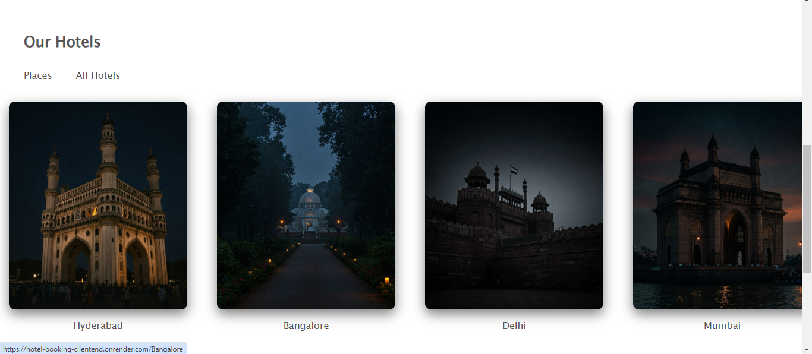
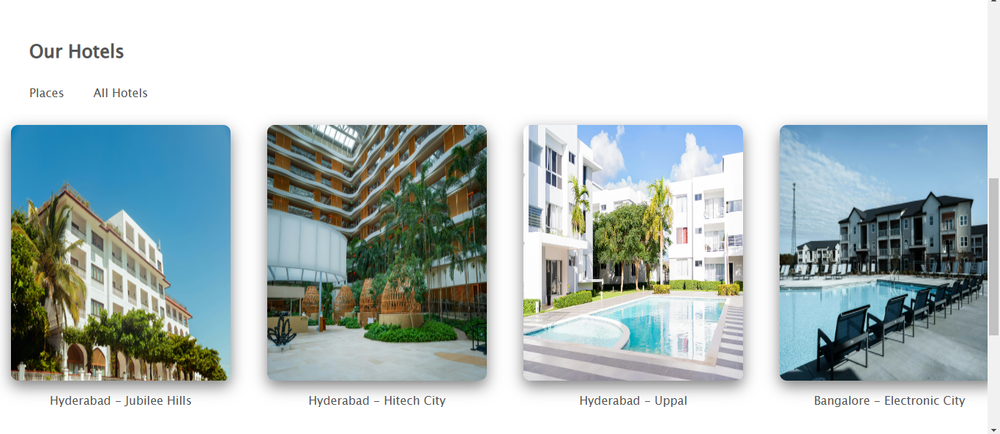
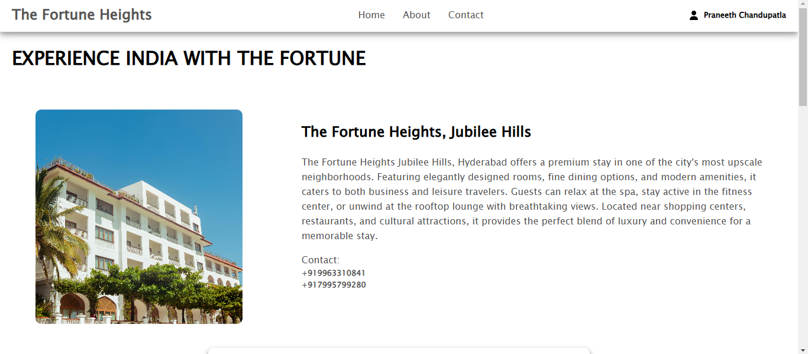
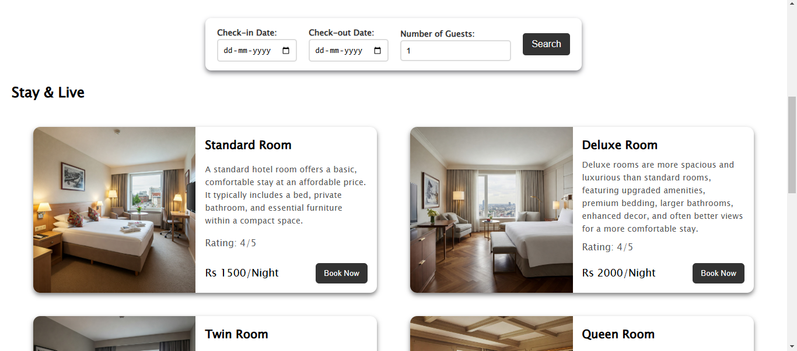
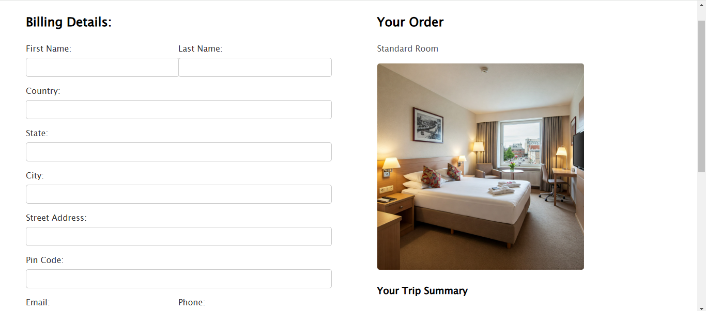
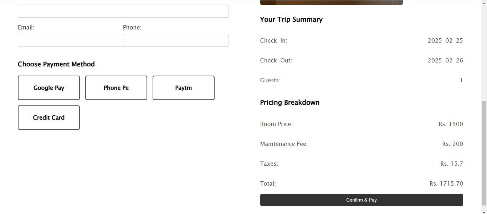

# 🏨 Hotel Booking System  

## 📌 Overview  

The **Hotel Booking System** is a **full-stack web application** built using the **MERN Stack** (MongoDB, Express.js, React.js, Node.js). It allows users to search for hotels by locations, view details, and make reservations seamlessly. The system also includes an **admin dashboard** (currently in development) for managing hotels, rooms, and user bookings efficiently.  

This project focuses on providing a smooth and intuitive **user experience**, with **secure authentication**, optimized database queries, and a **responsive UI**.  

## 🚀 Live Demo  

[🔗 View Live Project](https://hotel-booking-clientend.onrender.com/)  

---

## 🛠️ Tech Stack  

### **Frontend**  
- **React.js** – Frontend UI framework  
- **React Router** – Client-side navigation  
- **Axios** – HTTP requests
- **React Query** – Data fetching and caching
- **Zustand** – State management 

### **Backend**  
- **Node.js** – Server-side JavaScript runtime  
- **Express.js** – Backend framework  
- **MongoDB** – NoSQL database  
- **Mongoose** – ODM (Object Data Modeling)  

### **Authentication & Security**  
- **JSON Web Token (JWT)** – Secure authentication  
- **bcrypt.js** – Password hashing  
- **CORS** – Secure API requests  

### **Other Tools & Services**  
- **Multer** (for image uploads)  
- **MongoDB Atlas** (cloud database hosting)  

---

## ✨ Features  

### **User Functionalities**  
- **Secure Authentication** (Login & Signup with JWT)  
- **Search & Browse Hotels** (by location)  
- **View Hotel Details** (pricing, amenities, availability)  
- **Book Hotel Rooms**    

### **Admin Functionalities**  
- **Manage Hotels & Rooms** (add)  
  

### **Performance & UX Enhancements**  
- **Fully Responsive UI** for mobile & desktop  
- **Optimized MongoDB Queries** for faster performance  
- **Role-Based Access Control (RBAC)** (admin & user permissions)
- **React Query** Integration for efficient data fetching and caching
- **Zustand** Integration for better state management

---

## 🏗️ Folder Structure   
```bash
/Hotel-Booking
├── /frontend
│   ├── /public
│   ├── /src
│   │   ├── /components
│   │   ├── /pages
|   |   ├── /store
|   |   ├── /data
|   |   ├── /api
│   │   ├── App.js
│   │   ├── index.js
│   ├── package.json
│   ├── vite.config.js
├── /backend
│   ├── /config
│   ├── /controllers
│   ├── /middlewares
│   ├── /models
│   ├── /routes
│   ├── /utils
│   ├── server.js
│   ├── package.json
├── /adminend
│   ├── /public
│   ├── /src
│   │   ├── /components
│   │   ├── /pages
│   │   ├── App.js
│   │   ├── index.js
│   ├── package.json
│   ├── vite.config.js
├── .gitignore
├── README.md
```
---


## 📸 Screenshots  

<p align="center">
  
  
</p>

<p align="center">
  
  
</p>
<p align="center">
  
  
</p>
<p align="center">
  
  
</p>


